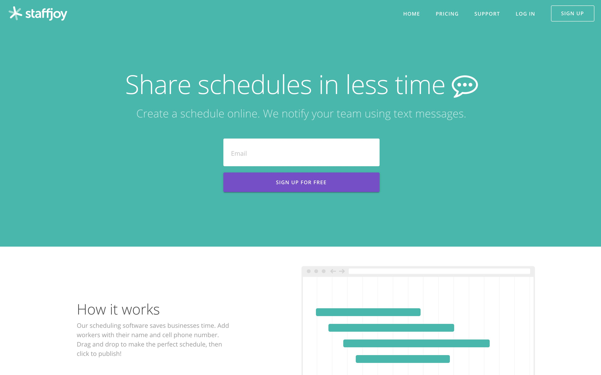
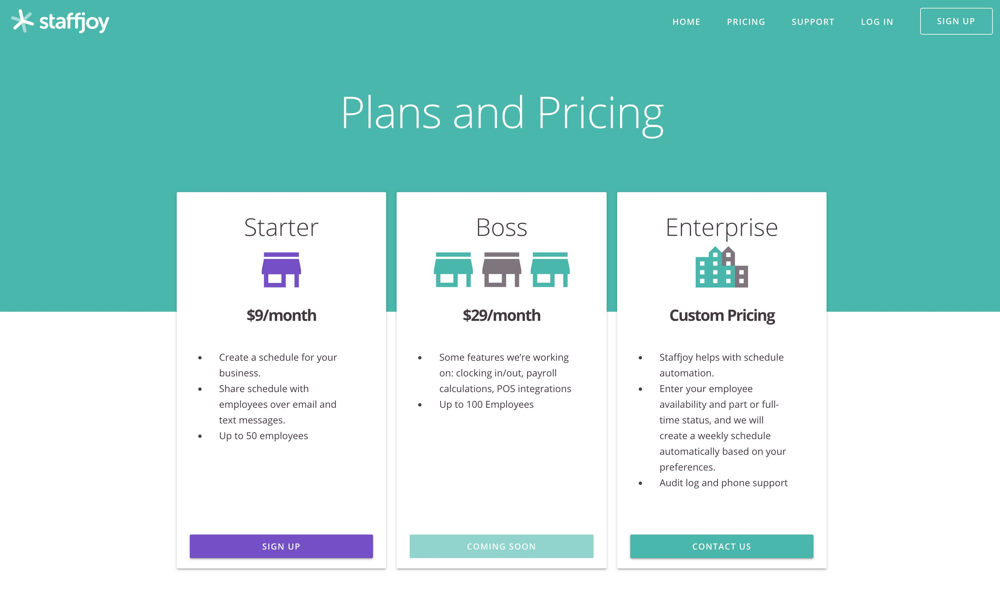
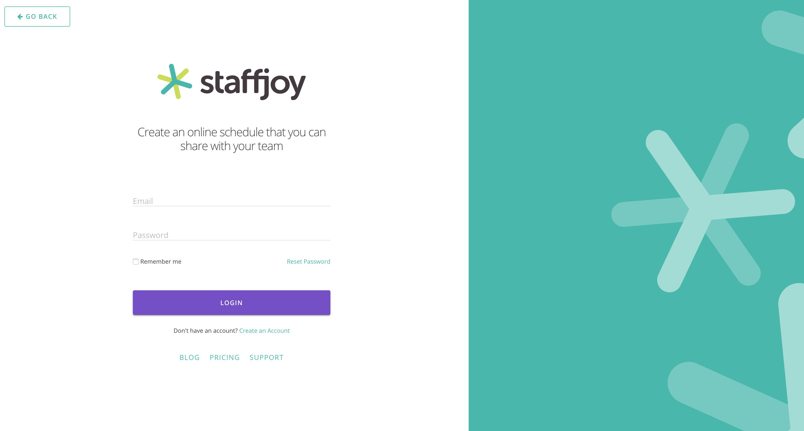
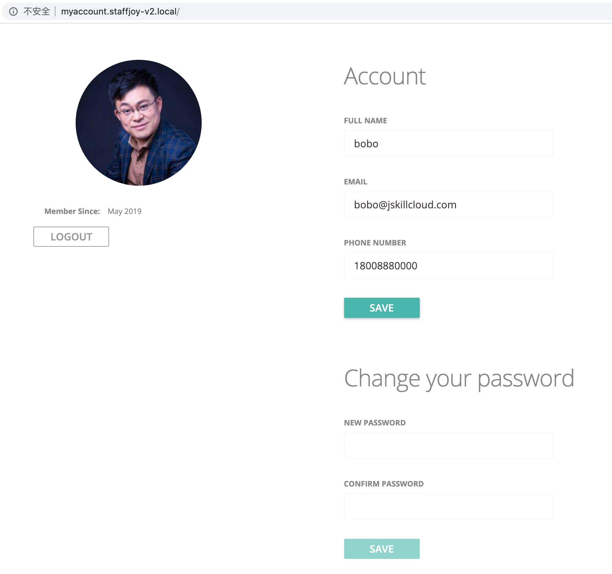
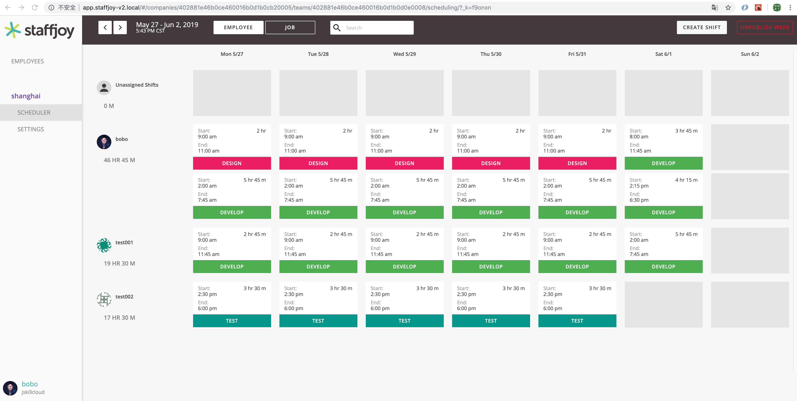

## 项目界面预览

### 1. 首页

### 2. 订购计划和价格页

### 3. 登录页

### 4. 雇员账户管理SPA单页应用

### 5. 我的公司SPA单页应用

## 其它可供参考微服务案例项目

* [eShopOnContainers](https://github.com/dotnet-architecture/eShopOnContainers) 微软支持
* [microservices-demo](https://github.com/GoogleCloudPlatform/microservices-demo) 谷歌支持
* [piggy-metrics](https://github.com/sqshq/piggymetrics)
